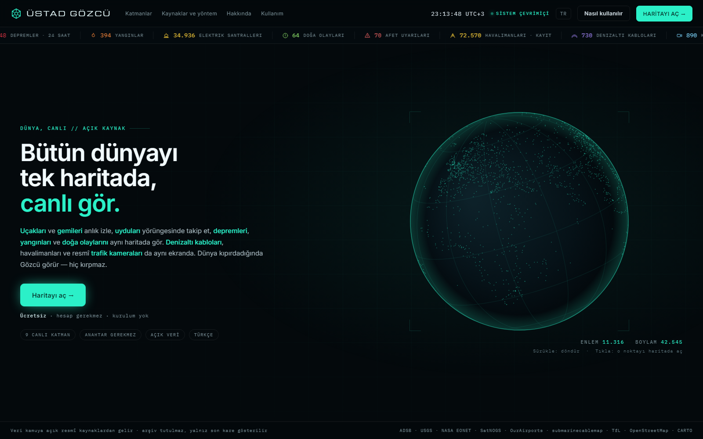
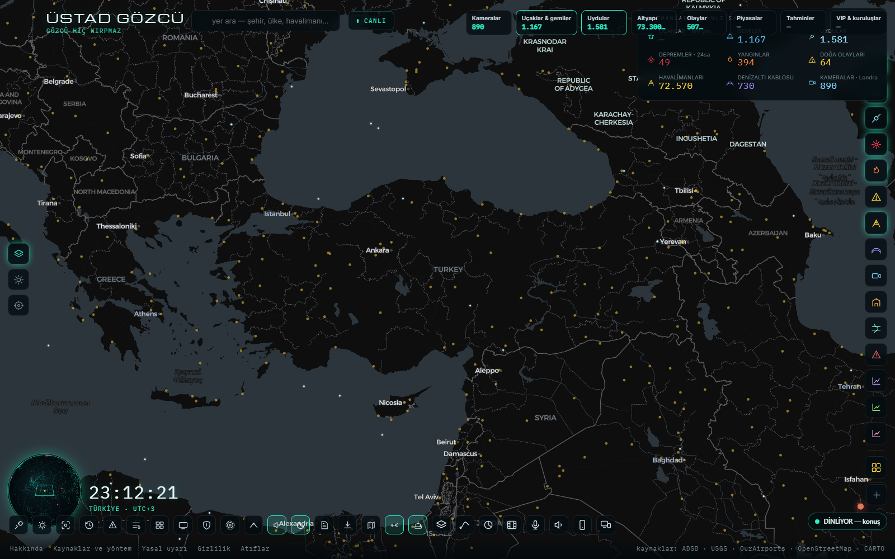
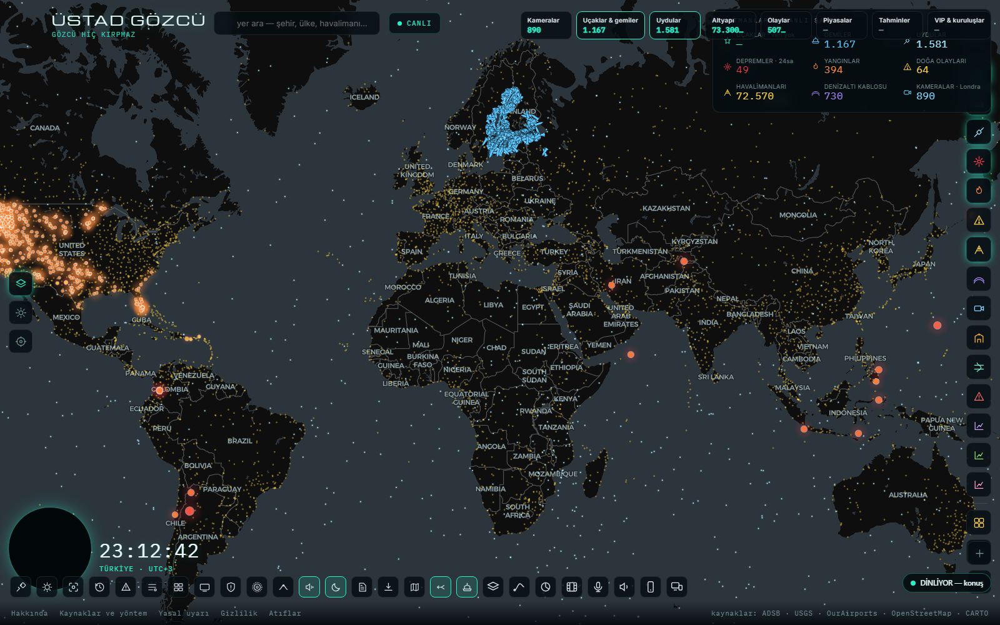
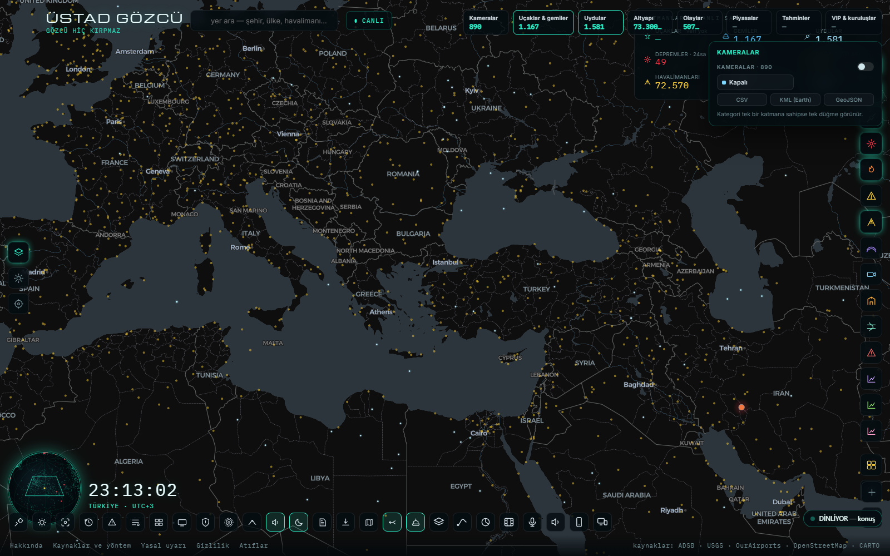
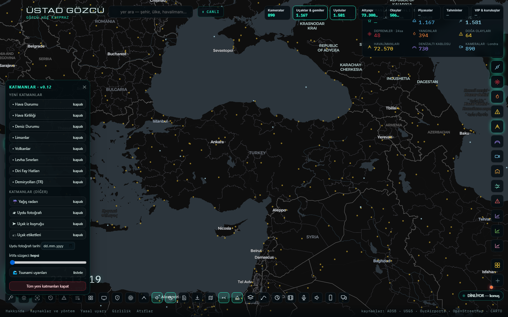
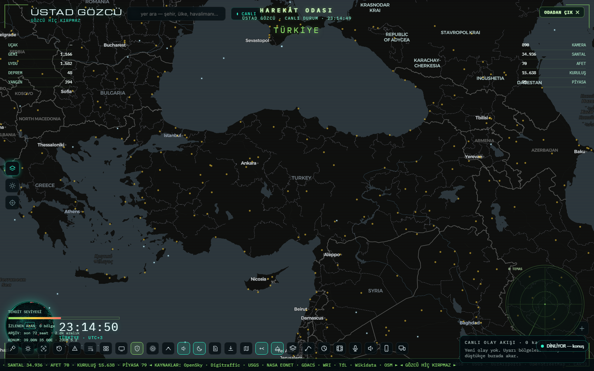

<div align="center">

# ÜSTAD GÖZCÜ

**Dünyayı canlı izleyen tek harita paneli**
<br>
*Uçaklar · Gemiler · Uydular · Depremler · Yangınlar · Kameralar · Altyapı · Piyasalar*


> **"Gözcü hiç kırpmaz."** — *We never blink.*



</div>

---

## Nedir?

**ÜSTAD GÖZCÜ**, tek bir tarayıcı sekmesinde dünyayı **canlı** izleyen kişisel bir
gözetleme (izleme) panelidir. Uçaklar, gemiler, uydular, depremler, yangınlar, doğa
olayları, afet uyarıları, havalimanları, denizaltı kabloları, kameralar, elektrik
santralleri, limanlar, volkanlar, diri fay hatları, hava durumu ve piyasalar — hepsi
aynı harita üzerinde, kendi Türkçe arayüzüyle.

Panel **kendi yerel sunucusuyla** çalışır (`harita/sunucu.py`, port **8811**).
Sunucu, CORS başlığı göndermeyen açık veri kaynaklarının önünde şeffaf bir köprü
kurar; kare önbelleği ve katmanlı TTL'lerle kaynakları yormadan veriyi tazeler.

**Hiçbir ticari harita servisi, hiçbir abonelik yok.** Katmanların tamamı ücretsiz ve
açık uçlardan gelir; büyük bölümü **anahtarsız** çalışır.

---

## Öne çıkanlar

| Yetenek | Ne yapar |
|---|---|
| 🗺️ **16 canlı katman** | Uçak · gemi · uydu · deprem · yangın · doğa olayı · afet uyarısı · havalimanı · santral · kablo · kamera · liman · volkan · levha · fay · piyasa |
| 🛰️ **Gerçek yörünge hesabı** | SatNOGS TLE verisi + SGP4; 1.678 uydu ~1,2 sn'de hesaplanır |
| ✈️ **Canlı hareket motoru** | Uçak ve gemiler rapolar arasında ölü hesapla pürüzsüz ilerler (uydurma hareket yok; yerdeki/hızı sıfır olan oynatılmaz) |
| 🕐 **Zaman makinesi** | 72 saatlik arşivi (SQLite, 6 katman, 2 dakika aralık) film gibi oynatır |
| ⚠️ **Uyarı + geofence** | Haritada seçtiğin kutu; içine giren deprem/yangın/uçak/gemi için anons + bildirim + WhatsApp/Discord köprüsü |
| 🎤 **Sesle her şey** | 73 hedef tanınır: "gemileri kapat", "harekât odası", "mor tema", "baltığa git" — tuşa basmadan kesintisiz dinler |
| 📱 **Telefondan kumanda** | `kumanda.html` (aynı ağ) → 26 düğme + serbest yazılı/sesli komut |
| 🎬 **Harekât odası** | Askerî şura görünümü: gerçek veriden beslenen radar (sahte blip yok) + canlı olay akışı |
| 📺 **Video duvarı + TV modu** | Görünen alana en yakın 16 kamera; TV modunda 3D eğimli, dönen tam ekran |
| 📤 **Dışa aktarma** | CSV (Excel-TR uyumlu) · KML (Google Earth) · GeoJSON · KML **içe** aktarma |
| 🌧️ **Hava ve deniz** | 81 il hava durumu + hava kirliliği, 16 kıyı noktası deniz durumu, canlı yağış radarı |
| 🛰️ **Geçmiş uydu fotoğrafı** | NASA GIBS'ten seçtiğin günün gerçek TrueColor görüntüsü |
| 📄 **Günlük Word raporu** | Renkli şeritli `.docx`: 81 il hava, son 24 saatin en büyük 10 depremi, uyarılar, piyasalar |
| 🤖 **MCP sunucusu** | `mcp_gozcu.py` — panel verisini yapay zekâ araçlarına açar (6 araç) |
| 🔒 **Gizlilik önde** | Tüm veri kendi bilgisayarında kalır; buluta hiçbir şey gönderilmez |

---

## Ekran görüntüleri

<div align="center">

**Ana panel — Türkiye**



**Dünya görünümü — canlı uçak trafiği**



**Filtre çekmecesi — katman bölümleri ve alt türler**



**Katman paneli — 16 katman bağımsız aç/kapa**



**Harekât odası — radar ve canlı olay akışı**



**Açılış perdesi — günün sözü**


</div>

---

## Katmanlar ve kaynakları

| # | Katman | Kaynak | Kayıt |
|---|---|---|---|
| 1 | Uçaklar | OpenSky (dünya) + adsb.lol / adsb.fi (yakın) | ~8.900 uçak |
| 2 | Gemiler | meri.digitraffic.fi açık AIS | 1.000+ gemi (Baltık) |
| 3 | Uydular | db.satnogs.org TLE + SGP4 | 1.678 uydu |
| 4 | Depremler | USGS GeoJSON | son 24 saat |
| 5 | Yangınlar | NASA EONET | 394 olay |
| 6 | Doğa olayları | NASA EONET | 64 olay |
| 7 | Afet uyarıları | GDACS | 69 olay |
| 8 | Havalimanları | OurAirports | 72.570 |
| 9 | Elektrik santralleri | WRI Global Power Plant DB | 34.936 |
| 10 | Denizaltı kabloları | submarinecablemap.com | 730 hat |
| 11 | Kameralar | Transport for London JamCams | 890 kamera |
| 12 | Limanlar | Wikidata | 4.564 |
| 13 | Volkanlar | Wikidata | 2.243 |
| 14 | Levha sınırları | PB2002 | 241 çizgi |
| 15 | Diri fay hatları | GEM | 407 fay (TR kutusu) |
| 16 | Piyasalar | Finnhub + Yahoo | 79 enstrüman |

**Ek katmanlar:** hava durumu (81 il) · hava kirliliği (81 il, PM2.5 + AQI) ·
deniz durumu (16 nokta) · yağış radarı (RainViewer, 2 saatlik animasyon) ·
geçmiş uydu fotoğrafı (NASA GIBS) · Türkiye il sınırları (81 il) · tahmin piyasaları
(Manifold, 180 piyasa) · boğazlar (19 darboğaz) · uçak iz kuyruğu · deprem dalgası.

---

## Mimari

```
        TARAYICI                        YEREL SUNUCU                   AÇIK KAYNAKLAR
  ┌──────────────────┐          ┌──────────────────────────┐      ┌────────────────────┐
  │  index.html      │  fetch   │      sunucu.py           │ HTTP │  OpenSky           │
  │  (HARİTA)        │ ───────► │      port 8811           │ ───► │  adsb.lol/adsb.fi  │
  │                  │  /veri/… │                          │      │  digitraffic.fi    │
  │  giris.html      │ ◄─────── │  • CORS köprüsü          │ ◄─── │  SatNOGS · USGS    │
  │  (GİRİŞ EKRANI)  │   JSON   │  • kare önbelleği (TTL)  │      │  NASA EONET/GIBS   │
  │                  │          │  • kaynak başına kilit   │      │  GDACS · Wikidata  │
  │  kumanda.html    │  POST    │  • gzip gövde çözücü     │      │  Open-Meteo        │
  │  (TELEFON)       │ ───────► │                          │      │  RainViewer        │
  └──────────────────┘          │  ┌────────────────────┐  │      │  Manifold · Finnhub│
                                │  │ arşiv.db (SQLite)  │  │      │  OSM Overpass      │
                                │  │ 72 saat · 6 katman │  │      └────────────────────┘
                                │  └────────────────────┘  │
                                │  uyarı döngüsü · MCP     │
                                └──────────────────────────┘
```

- **Kare önbelleği ve kaynak görgüsü:** `ISTEK_ARALIK=1.2` sn kilit, `ES_ZAMANLI=2`
  eşzamanlılık, 429'da katlanarak artan ceza (90→900 sn). Gönüllü ağları yormamak
  için bu değerler yükseltilmez.
- **Dürüst sayaç:** kaynak düşerse sayı **0 yapılmaz**; "veri yok" ya da soluk
  "son bilinen" yazar.
- **Sunucu şart:** `index.html` dosya olarak açılırsa panel boş kalır — çoğu kaynak
  CORS başlığı göndermiyor.

---

## Kurulum (Windows)

```bash
git clone https://github.com/kenankuzucu/ustad-gozcu.git
cd ustad-gozcu
python -m pip install sgp4            # uydu yörünge hesabı (opsiyonel ama önerilir)
cd harita
BASLAT.bat                            # sunucu + giriş ekranı
```

Ardından tarayıcıda **http://127.0.0.1:8811** açılır.

| Dosya | İş |
|---|---|
| `harita/BASLAT.bat` | Sunucuyu başlatır + giriş ekranını açar |
| `harita/GIRIS.bat` | Yalnız giriş ekranı (küre) |
| `harita/HARITA.bat` | Yalnız harita |
| `harita/DURDUR.bat` | Sunucuyu kapatır |

**Anahtarlı katmanlar (opsiyonel):** `ayar.ornek.json` dosyasını `ayar.json` olarak
kopyalayıp anahtarlarını yaz. Boş bırakırsan o katman sessizce kapalı kalır, panelin
geri kalanı tam çalışır.

```json
{ "finnhub_anahtar": "...", "aisstream_anahtar": "...", "bildirim_webhook": "..." }
```

---

## Sesle kullanım

Panel açıldıktan sonra mikrofon iznini **bir kez** ver; sonrasında tuşa basmadan dinler.

```
"gözcü gemileri kapat"        →  katman kapanır, Türkçe sesli onay gelir
"uçakları kapat ve gemileri aç"  →  çoklu komut
"harekât odası"               →  askerî şura görünümü
"mor tema" / "buz tema"       →  tema değişir
"baltığa git"                 →  bölgeye uçar (konuşma çekimi çözülür)
"hepsini aç" · "temizle" · "neler yapabilirsin"
"sustur"                      →  dinleme durur
```

Tanıma 6 aday döndürür ve panel hepsini puanlar; yakın söylenişler (Levenshtein
benzerliği ≥ 0,79) ve konuşma çekimleri düzeltilir. Panel kendi anonsunu duymaz
(geri besleme kapısı).

---

## Dosya düzeni

```
USTAD-GOZCU/
├─ harita/
│  ├─ index.html        HARİTA — ana uygulama (MapLibre GL, tek dosya CSS/JS)
│  ├─ giris.html        GİRİŞ EKRANI — dönen küre, canlı sayaç şeridi
│  ├─ kumanda.html      Telefon kumandası
│  ├─ sunucu.py         Veri köprüsü + arşiv + uyarı motoru (port 8811)
│  ├─ mcp_gozcu.py      MCP sunucusu (yapay zekâ araçları)
│  ├─ bildirim.py       Uyarı kuyruğu → Türkçe bildirim metni
│  ├─ gozcu-rapor.py    Günlük renkli Word raporu
│  ├─ gozcu-liste.py    Proje envanteri (.docx)
│  └─ *.bat             Başlat / durdur kısayolları
├─ veri/                Arşiv (SQLite) ve indirilen önbellekler — çalışırken oluşur
├─ ekran/               Bu README'deki ekran görüntüleri
├─ referans/            Geliştirme sırasında alınan görseller (yerel)
├─ OKU-BENI.md          Ayrıntılı proje günlüğü ve sürüm notları
└─ KAYNAKLAR.md         Doğrulanmış veri uçları listesi
```

---

## Depoda olmayanlar

| Ne | Neden |
|---|---|
| `ayar.json` | API anahtarları — sırlar depoya girmez (`ayar.ornek.json` var) |
| `harita/foto/` | Kenan'ın kişisel madalyon fotoğrafı |
| `veri/arsiv.db`, `veri/onbellek/` | Çalışma zamanında oluşan büyük veri dosyaları (50 MB +) |
| `harita/kutuphane/` | Gömülü `sgp4` kütüphanesi — `pip install sgp4` ile kurulur |

---

## Veri kaynakları ve atıflar

Bu panel bir veri **toplayıcıdır**; veriyi üreten kurumların emeği esastır:

- **OpenSky Network**, **adsb.lol**, **adsb.fi** — uçak konumları (gönüllü ağlar)
- **Fintraffic / meri.digitraffic.fi** — açık AIS gemi verisi
- **SatNOGS** — uydu TLE verisi · **USGS** — depremler
- **NASA EONET / GIBS** — doğa olayları ve uydu görüntüsü
- **GDACS (Avrupa Komisyonu)** — afet uyarıları
- **OurAirports**, **WRI**, **submarinecablemap.com**, **PB2002**, **GEM**
- **Wikidata**, **OpenStreetMap katkıcıları**, **Open-Meteo**, **RainViewer**
- **Transport for London** — JamCam kameraları · **Manifold Markets**, **Finnhub**, **Yahoo Finance**
- Harita zemini: **CARTO Dark Matter** · Çizim: **MapLibre GL JS**

Görünüm bakımından esin kaynağı: argosatlas.com haritası. **Logo, isim ve marka
kullanılmamıştır** — görünüm taklit edilir, kimlik bize aittir.

---

## Sürüm geçmişi (özet)

| Sürüm | Getirdiği |
|---|---|
| v0.4.0 | Argos düzeni: 7 kategori çipi + filtre çekmecesi, 3 sol alt araç |
| v0.5.0 | Arşiv/geçmişe sarma · uyarı + geofence · CSV/KML/GeoJSON · video duvarı + TV |
| v0.7.0 | Harekât odası (gerçek veriden radar + gezinti) |
| v0.8.0 | Uyarı köprüsü (WhatsApp/Discord) · uçak izi · deprem dalgası · günlük rapor · MCP |
| v0.10.0 | Canlı uçak hareketi (ölü hesap, knot birimi) |
| v0.11.0 | Gemi hareketi · açılış perdesi (günün sözü) |
| v0.12.0 | 8 yeni katman · yağış radarı · uydu fotoğrafı · iz kuyruğu · katman paneli |
| v0.13.0 | Zaman makinesi · sesli komut · telefon kumandası · 2. ekran |
| v0.14.0 | Sesle her şey: 73 hedef, çoklu komut, konuşma çekimi çözümü |
| v0.15.0 | Otomatik sesli dinleme (tuşa basmadan, geri besleme korumalı) |
| **v0.15.1** | Ses hassasiyeti: 6 aday puanlama, yakın söyleniş, dolgu sözcük temizliği |

---

<div align="center">

### ÜSTAD KENAN KUZUCU

**Gaziantep · Türkiye**

Kuaför, otodidakt yazılımcı, siber güvenlik öğrencisi.
Bu panel; merak, inat ve gece yarısı kahvesiyle yazıldı.

*Kişisel ve eğitim amaçlı bir projedir. Kaynak veriler kendi lisanslarına tabidir;
tıbbi, hukuki veya resmî karar dayanağı değildir.*

</div>
